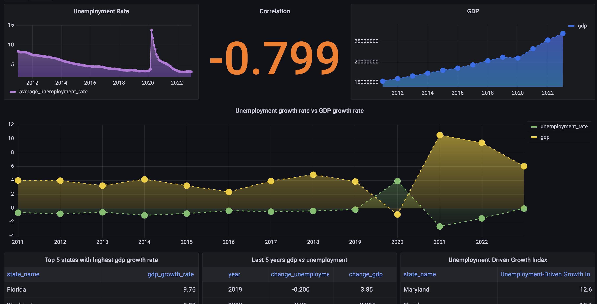

# Okun's Law Analysis with FRED Data
This project aims to empirically analyze Okun's Law, which suggests an inverse relationship between unemployment and GDP growth, using economic data from the Federal Reserve Economic Data (FRED). Data is collected, transformed, and analyzed to test Okun's Law across different U.S. states.

### Workflow for Okun's Law analysis using FRED data


Project Structure
```bash
.
├── EXTRACT
│   ├── FREDDataFetcher.py         # Script to fetch data from FRED API
│   ├── gdp_data.py                # Script to extract GDP data from FRED
│   ├── state_codes.json           # JSON file mapping state names to codes
│   ├── unemployment_data.py       # Script to extract unemployment data from FRED
├── README.md                      # Project documentation
├── config.json                    # Configuration file for API keys and settings
├── database
│   ├── database_loader.py         # Script to load data into the database
├── dbt_fred
│   ├── dbt_project.yml            # dbt project configuration
│   ├── models                     # dbt models for data transformations
│   ├── tests                      # Tests for validation of transformations
├── sql
│   └── raw_tables                 # SQL scripts for raw data tables
```
Objective
The goal of this project is to analyze how Okun's Law holds across various U.S. states. By using data on GDP growth and unemployment rates from FRED, we aim to quantify the relationship between economic growth and unemployment levels in line with Okun's Law.

Data Sources
Gross Domestic Product (GDP) by State: Retrieved using gdp_data.py.
Unemployment Rates by State: Retrieved using unemployment_data.py.
State Codes: state_codes.json file maps state names to their respective codes used in FRED.

Set up config.json with your FRED API key and other configuration settings:
```bash
{
  "api_keys": {
    "fred_api_key": "e651cfc10fce0019d85cf23c192706e2"
  },
  "database": {
    "host": "localhost",
    "user": "postgres",
    "port": 5432,
    "password": "1234",
    "dbname": "fred"
  }
}
```
Data Extraction
Fetching GDP Data:

Use gdp_data.py to extract GDP data by state:

```bash
python EXTRACT/gdp_data.py
```

Fetching Unemployment Data:

Use unemployment_data.py to extract unemployment rate data by state:

```bash

python EXTRACT/unemployment_data.py
```
The extracted data will be stored in a database or as CSV files based on the configuration.

Database Loading
Load the extracted data into a PostgreSQL database using database_loader.py:

```bash

python database/database_loader.py
```
Data Transformation with dbt
Run dbt to transform raw GDP and unemployment data into models ready for analysis:

``` bash
cd dbt_fred
dbt run
```

### Analysis
Once the data is processed, the analysis will focus on:

- Calculating the relationship between GDP growth and unemployment rates for each U.S. state.
- Visualizing trends to understand how closely the data aligns with Okun's Law.
- Cross-state comparisons to observe variations in how Okun's Law applies across different regions.
### Grafana Dashboard output : 

Incorporating other economic indicators (e.g., inflation) to see if they affect the relationship between unemployment and GDP growth.
Extending the analysis to multiple time periods for longitudinal studies.
